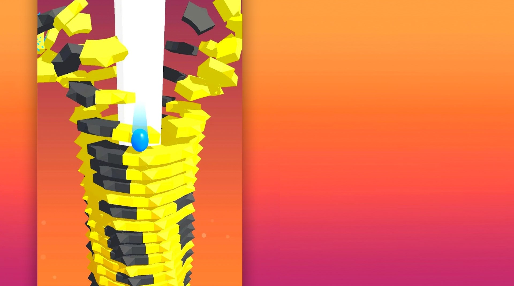

# MetalBall Crush 3D

Play online at: https://bytenol.github.io/MetalBall-Crush-3D/



## How to Contribute
Ensure to create an empty directory "emscripten_build" locally, this directory is where emscripten cmake cached files will be saved in. 
The command to build the source has been integrated inside the nodeon.json file. 

All you need to do is to run the following commands in seperate command shell


```bash 
npx vite
npx nodemon
```

whenever the you make any changes to the .cpp, .json or .obj files, it automatically rebuild the project.

### Note
Make sure you have vite and nodemon installed. Open the project folder and run the command below to install any dependencies

```bash
npm install
